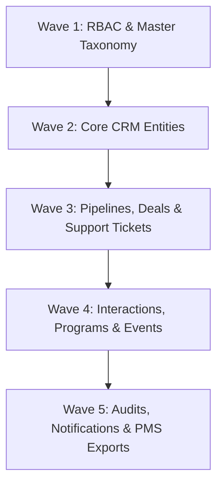

# Ethiopian IT Park — CRM System

A full-stack, enterprise Customer Relationship Management (CRM) platform engineered for **Ethiopian IT Park** to manage relationships with startups, investors, partners, and corporate clients.

Built in strict compliance with **SRS v1.0** and **CRM Database Design v2.0**.

---

## Technology Stack

- **Backend**: Laravel 11 (PHP 8.3-FPM) with Sanctum token authentication & Eloquent ORM
- **Frontend**: React 19 + TypeScript + Vite + Tailwind CSS v4 (`@tailwindcss/vite`)
- **Database**: PostgreSQL 16 (29 Relational tables with strict foreign keys & soft-deletes)
- **Cache & Queues**: Redis 7-alpine (ticket reminders, rate limiting, and async jobs)
- **Web Server**: Nginx (reverse proxy routing to PHP-FPM and frontend)
- **Email Testing**: Mailpit (local SMTP capture on port `1025`, web dashboard on port `8025`)
- **Orchestration**: Docker Compose (multi-container development & production parity)

---

## Services & Port Bindings

| Service | Container Name | Port (Host:Container) | Functionality |
|---|---|---|---|
| **Frontend UI** | `crm_frontend` | `5173:5173` | React 19 + Tailwind v4 Dev Server with hot-reload |
| **Backend API** | `crm_nginx` | `8000:80` | Reverse proxy serving Laravel REST API |
| **PostgreSQL 16** | `crm_postgres` | `5432:5432` | Relational database (`crm_db`) |
| **Redis 7** | `crm_redis` | `6379:6379` | Cache, queues & rate limiting |
| **Mailpit UI** | `crm_mailpit` | `8025:8025` | Local email testing dashboard |
| **Mailpit SMTP** | `crm_mailpit` | `1025:1025` | Notification SMTP gateway |
| **PHP-FPM** | `crm_backend` | `9000` (internal) | Core PHP 8.3 runtime (`pdo_pgsql`, `redis`, `intl`) |
| **Queue Worker** | `crm_queue` | internal | Background queue worker (`artisan queue:work`) |
| **Task Scheduler** | `crm_scheduler` | internal | Automated ticket inactivity & SLA monitor |

---

## Quick Start (For New Developers)

### 1. Prerequisites
- **Git** installed
- **Docker Desktop** (Windows / macOS) or **Docker Engine + Docker Compose** (Linux) running

*(You do **not** need PHP, Composer, Node.js, or PostgreSQL installed locally on your host machine).*

### 2. Clone the Repository
```bash
git clone https://github.com/haile2967/CRM-IT-Park.git
cd CRM-IT-Park
```

### 3. Setup Environment Files
**Windows (PowerShell):**
```powershell
Copy-Item .env.example .env
Copy-Item backend/.env.example backend/.env
```

**macOS / Linux / Git Bash:**
```bash
cp .env.example .env
cp backend/.env.example backend/.env
```

### 4. Build & Start All Containers
```bash
docker compose up -d --build
```

### 5. Run Database Migrations & Seeders
```bash
docker exec -it crm_backend php artisan migrate:fresh --seed
```

### 6. Access Applications
- 🌐 **Frontend App**: [http://localhost:5173](http://localhost:5173)
- ⚙️ **Backend API Status**: [http://localhost:8000](http://localhost:8000)
- 🩺 **Health Diagnostic API**: [http://localhost:8000/api/v1/health](http://localhost:8000/api/v1/health)
- ✉️ **Mailbox (Mailpit)**: [http://localhost:8025](http://localhost:8025)

---

## Default Seeded Accounts & Credentials

The database seeder pre-configures accounts for each of the 4 defined CRM roles (SRS v1.0 §3.2):

| Role | Email | Password | Responsibilities & Scope |
|---|---|---|---|
| **System Administrator** | `admin@itpark.gov.et` | `Admin@ITPark2026!` | Configuration, user accounts, master reference data, pipelines |
| **CRM Manager** | `manager@itpark.gov.et` | `Manager@ITPark2026!` | Full global visibility across all leads, deals, tickets, and reports |
| **Business Development Officer** | `bdo@itpark.gov.et` | `BDO@ITPark2026!` | Lead capture & qualification, opportunity progression, activity logs |
| **Support Agent** | `support@itpark.gov.et` | `Support@ITPark2026!` | Ticket queues, customer triage, inactivity escalation monitoring |

---

## Database Schema (29 Tables Breakdown)

The database schema strictly implements [CRM_Database_Design_v2.0.pdf](Document/CRM_Database_Design_v2.0.pdf), organized across **5 dependency waves**:



### 1. Wave 1: Security, Taxonomy & Calendars
- `roles` — The 4 system roles and seniority tiers (`role_tier`).
- `users` — System users with soft-deactivation (`status`, `deactivated_at`).
- `lead_sources` — Configurable acquisition channels (Referral, Website, Event, etc.).
- `reference_categories` — Multi-group categories for organizations and leads.
- `opportunity_types` — Investment, partnership, service, program enrollment.
- `pipeline_stages` — Configurable deal stages (`display_order`, `is_closed_won`, `is_closed_lost`).
- `ticket_categories` — Technical, service request, general inquiry.
- `business_hours_calendars` — Configurable calendar (Ethiopian IT Park working hours).
- `business_hours` — Daily shifts (Monday–Friday 08:30–17:30).
- `business_holidays` — Exceptions and official holidays.

### 2. Wave 2: Core Business Entities
- `accounts` — Organizations (startup, investor, company, government, partner) with ownership.
- `contacts` — Individuals linked to an account (`is_primary` flag per FR-ACCOUNT-005).
- `leads` — Unqualified prospects with duplicate warnings, notes, and conversion timestamps.

### 3. Wave 3: Pipeline Deals & Support Ticketing
- `opportunities` — Qualified commercial engagements with value, probability, and closing date.
- `opportunity_stage_history` — Comprehensive audit trail of stage transitions.
- `escalation_policies` — Configurable reminder and escalation thresholds per priority tier (BR-001).
- `escalation_recipients` — Recipients designated for ticket escalation alerts.
- `tickets` — Support requests with `last_activity_at`, inactivity calculation, and independent `escalated` flag.
- `ticket_escalation_history` — Preserves historical escalations even after flags clear (BR-005).
- `ticket_comments` — Notes and updates that reset ticket activity clocks (BR-004).

### 4. Wave 4: Activities, Programs & Events
- `activities` — Scheduled calls, meetings, tasks linked to leads, accounts, contacts, or deals.
- `communications` — Unified interaction history (emails, messages, call logs, notes).
- `programs` — Incubation, training, and workshop tracks.
- `program_applications` — Stakeholder participation lifecycle (Applied → Accepted/Enrolled → Completed/Withdrawn).
- `events` & `event_registrations` — Capacity tracking and attendee registrations.

### 5. Wave 5: Audits, Notifications & PMS Handoff
- `notifications` — Inactivity alerts, reminders, and system notifications.
- `audit_logs` — Field-level tracking (`entity_type`, `entity_id`, `field_name`, `old_value`, `new_value`, IP address).
- `export_records` — Permanent audit trace for manual PMS handoffs (CSV, Excel, JSON) upon Closed Won.

---

## Core Business Rules & Logic

1. **Role-Based Record Visibility (§3.3 & SEC-001)**:
   - **CRM Manager**: Global visibility across all business records.
   - **BDO**: Ownership-based visibility (`owner_user_id == auth()->id()`).
   - **Support Agent**: Access to assigned tickets + shared unassigned queue, plus read-only account/contact details.
   - **Ownership Transfer Guard (BR-002)**: Only current owner, CRM Manager, or Administrator can reassign record ownership.

2. **Lead-to-Account/Opportunity Conversion (WF-001 & BR-006)**:
   - Converting a qualified lead atomically creates or links an `Account` and a `Contact` (marked `is_primary = true`).
   - Creating an `Opportunity` is required only when the engagement has a commercial dimension.

3. **Inactivity Escalation Engine (WF-005, BR-001, BR-004)**:
   - Urgent / High priority measured in continuous 24/7 calendar minutes.
   - Medium / Low priority measured against active hours from `business_hours` excluding holidays.
   - Reminder threshold must be strictly less than escalation threshold.
   - Escalation notifications are sanitized (FR-TICKET-025: no PII/body, login-gated link only).

4. **PMS Closed Won Handoff (§10.1 & EXT-006)**:
   - Once an Opportunity reaches `Closed Won`, authorized users can manually export Account, Primary Contact, and Opportunity data into CSV, Excel, or JSON.

---

## Useful Development Commands

```powershell
# Check database tables and sizes
docker exec -it crm_backend php artisan db:show

# Run or refresh migrations
docker exec -it crm_backend php artisan migrate:fresh --seed

# View registered routes
docker exec -it crm_backend php artisan route:list

# View container logs
docker compose logs -f backend
docker compose logs -f frontend

# Restart services
docker compose restart frontend
docker compose restart backend
```

---

## References

- [SRS v1.0 Document](Document/SRS_v1.0.pdf) — Software Requirements Specification
- [Database Design v2.0 Document](Document/CRM_Database_Design_v2.0.pdf) — 29-Table Physical Database Design
