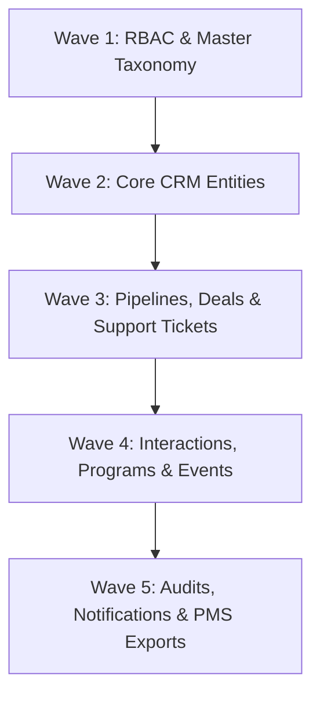

# Ethiopian IT Park — CRM System

A modern, full-stack, enterprise Customer Relationship Management (CRM) platform engineered for the **Ethiopian IT Park** to manage end-to-end interactions with tech startups, investors, development partners, and commercial tenants.

Built in strict compliance with **SRS v1.0** and **CRM Database Design v2.0**.

---

## Project Status & Implemented Milestones

| Milestone / Component | Specification | Status | Description |
|---|---|---|---|
| **Multi-Container Stack** | Docker Compose | ✅ Complete | 8 services: PostgreSQL 16, Redis 7, PHP 8.3 FPM, Nginx, React 19, Mailpit, Queue & Scheduler |
| **Complete Database Schema** | Database Design v2.0 | ✅ Complete | 29 relational tables across 5 dependency migration waves with strict FKs & soft deletes |
| **Baseline Seed Data** | SRS v1.0 §3.2 | ✅ Complete | 4 core roles, system users, calendars, SLA policies, lead sources, and reference taxonomies |
| **Eloquent ORM Models** | Laravel 11 | ✅ Complete | All 29 Eloquent models with custom primary keys (`*_id`), casts, and relational mappings |
| **Headless Architecture** | Separation of Concerns | ✅ Complete | Backend stripped of Blade/Vite assets to run purely as headless REST API; frontend in `frontend/` |
| **Frontend Foundation** | React 19 + Tailwind v4 | ✅ Complete | Vite dev server running on port `5174` with Tailwind CSS v4 (`@tailwindcss/vite`) and branded shell |
| **Authentication & Tokens** | SEC-003, SEC-005 | ✅ Complete | Laravel Sanctum token auth, profile management, password change, and token revocation |
| **Brute-Force Defense** | SEC-004 | ✅ Complete | 5 failed login attempts trigger an automatic 15-minute lockout (HTTP 429) |
| **Account Soft Deactivation** | SEC-005, FR-RBAC-004 | ✅ Complete | Inactive users blocked (HTTP 403); active tokens immediately purged upon deactivation |
| **Role-Based Access Control** | SEC-001, §3.3 | ✅ Complete | `CheckRole` middleware and `VisibleToRole` portfolio-scoping trait across 4 defined roles |
| **Centralized Audit Logging** | Wave 5 Schema | ✅ Complete | `AuditLogger` service recording user actions, IP, user-agent, and state changes into `audit_logs` |
| **User Management API** | FR-RBAC-004 | ✅ Complete | User CRUD, portfolio statistics, status toggle, protection against self-deactivation & orphan admin |
| **Automated Security Tests** | PHPUnit 12 | ✅ Complete | Feature test suite covering health, auth, brute-force lockout, RBAC restrictions, and user guards |

---

## Technology Stack

- **Backend**: Laravel 11 (PHP 8.3-FPM) running strictly headless with Sanctum token authentication & Eloquent ORM
- **Frontend**: React 19 + TypeScript + Vite + Tailwind CSS v4 (`@tailwindcss/vite`) on port `5174`
- **Database**: PostgreSQL 16 (29 Relational tables with strict foreign keys, indexes & soft-deletes)
- **Cache, Sessions & Queues**: Redis 7-alpine (rate limiting, ticket reminders, and asynchronous jobs)
- **Web Server / Reverse Proxy**: Nginx (serving backend API on port `8000`)
- **Email Testing**: Mailpit (local SMTP capture on port `1025`, web dashboard on port `8025`)
- **Orchestration**: Docker Compose (multi-container development & production parity)

---

## Services & Port Bindings

| Service | Container Name | Port (Host:Container) | Functionality |
|---|---|---|---|
| **Frontend UI** | `crm_frontend` | `5174:5174` | React 19 + Tailwind v4 Dev Server with hot-reload |
| **Backend API** | `crm_nginx` | `8000:80` | Reverse proxy serving Laravel REST API |
| **PostgreSQL 16** | `crm_postgres` | `5432:5432` | Relational database (`crm_db`) |
| **Redis 7** | `crm_redis` | `6379:6379` | Cache, queues & rate limiting |
| **Mailpit UI** | `crm_mailpit` | `8025:8025` | Local email testing dashboard |
| **Mailpit SMTP** | `crm_mailpit` | `1025:1025` | Notification SMTP gateway |
| **PHP-FPM** | `crm_backend` | `9000` (internal) | Core PHP 8.3 runtime (`pdo_pgsql`, `redis`, `intl`) |
| **Queue Worker** | `crm_queue` | internal | Background queue worker (`artisan queue:work`) |
| **Task Scheduler** | `crm_scheduler` | internal | Automated ticket inactivity & SLA monitor |

---

## Quick Start (For Developers)

### 1. Prerequisites
- **Git** installed
- **Docker Desktop** (Windows / macOS) or **Docker Engine + Docker Compose** (Linux) running

*(You do **not** need PHP, Composer, Node.js, or PostgreSQL installed locally on your host machine).*

### 2. Clone the Repository
```bash
git clone https://github.com/haile2967/CRM-IT-Park.git
cd CRM-IT-Park
```

### 3. Setup Environment Files
**Windows (PowerShell):**
```powershell
Copy-Item .env.example .env
Copy-Item backend/.env.example backend/.env
```

**macOS / Linux / Git Bash:**
```bash
cp .env.example .env
cp backend/.env.example backend/.env
```

### 4. Build & Start All Containers
```bash
docker compose up -d --build
```

### 5. Run Database Migrations & Seeders
```bash
docker exec -it crm_backend php artisan migrate:fresh --seed
```

### 6. Access Applications
- 🌐 **Frontend App**: [http://localhost:5174](http://localhost:5174)
- ⚙️ **Backend API Status**: [http://localhost:8000](http://localhost:8000)
- 🩺 **Health Diagnostic API**: [http://localhost:8000/api/v1/health](http://localhost:8000/api/v1/health)
- ✉️ **Mailbox (Mailpit)**: [http://localhost:8025](http://localhost:8025)

---

## Default Seeded Accounts & Credentials

The database seeder pre-configures accounts for each of the 4 defined CRM roles (SRS v1.0 §3.2):

| Role | Email | Password | Responsibilities & Scope |
|---|---|---|---|
| **System Administrator** | `admin@itpark.gov.et` | `Admin@ITPark2026!` | Configuration, user accounts, master reference data, pipelines |
| **CRM Manager** | `manager@itpark.gov.et` | `Manager@ITPark2026!` | Full global visibility across all leads, deals, tickets, and reports |
| **Business Development Officer** | `bdo@itpark.gov.et` | `BDO@ITPark2026!` | Lead capture & qualification, opportunity progression, activity logs |
| **Support Agent** | `support@itpark.gov.et` | `Support@ITPark2026!` | Ticket queues, customer triage, inactivity escalation monitoring |

---

## Implemented API Endpoints (`/api/v1`)

### 1. Health & Diagnostics
- `GET /api/v1/health` — Multi-service health check reporting connection states for PostgreSQL, Redis, and Mailpit.

### 2. Authentication & Profile
- `POST /api/v1/auth/login` — Authenticate using email and password. Enforces SEC-004 (5 failed attempts / 15-minute lockout) and SEC-005 (rejects inactive users with 403). Returns Sanctum bearer token and user role.
- `POST /api/v1/auth/logout` *(Auth)* — Revoke the current active token and record logout audit log.
- `GET /api/v1/auth/me` *(Auth)* — Returns current user profile, role info, and computed boolean permissions (`is_admin`, `is_crm_manager`, `is_bdo`, `is_support_agent`).
- `PUT /api/v1/auth/profile` *(Auth)* — Update current user's name and phone number.
- `PUT /api/v1/auth/change-password` *(Auth)* — Change password with current password verification.

### 3. Roles Reference
- `GET /api/v1/roles` *(Auth)* — List all system roles ordered by tier hierarchy.

### 4. User Management (FR-RBAC-004)
- `GET /api/v1/users` *(Auth, Admin/Manager)* — List users with search (`name`, `email`), `role_id` and `status` filters, and pagination.
- `GET /api/v1/users/{id}` *(Auth, Admin/Manager)* — Show user details along with portfolio statistics (`leads_count`, `accounts_count`, `opportunities_count`, `assigned_tickets_count`).
- `POST /api/v1/users` *(Auth, Admin)* — Create a new user with role assignment and hashed password.
- `PUT /api/v1/users/{id}` *(Auth, Admin)* — Update user details or reassign role.
- `PATCH /api/v1/users/{id}/status` *(Auth, Admin)* — Soft activate or deactivate a user. When deactivating:
  - Sets `status = 'inactive'` and `deactivated_at = now()`.
  - Immediately revokes all active API tokens for that user.
  - Safeguard: Prevents admin from deactivating their own account.
  - Safeguard: Prevents deactivating the last active System Administrator.

---

## All 29 Eloquent Models & Database Schema

The database strictly implements the 29 domain tables from [CRM_Database_Design_v2.0.pdf](Document/CRM_Database_Design_v2.0.pdf). Every model is mapped with explicit primary keys (`*_id`), datetime casts, and Eloquent relationships:



### 1. Security, Taxonomy & Calendars (Wave 1)
| Model | Table | Primary Key | Description |
|---|---|---|---|
| `Role` | `roles` | `role_id` | System roles and tier levels (`role_tier` 1-4) |
| `User` | `users` | `user_id` | System users with Sanctum tokens, soft-deactivation, and role relation |
| `LeadSource` | `lead_sources` | `source_id` | Configurable acquisition sources (Referral, Website, Event, etc.) |
| `ReferenceCategory` | `reference_categories` | `category_id` | Organization types, industries, lead segments |
| `OpportunityType` | `opportunity_types` | `type_id` | Investment, partnership, commercial tenancy, incubation |
| `PipelineStage` | `pipeline_stages` | `stage_id` | Pipeline stages (`display_order`, `is_closed_won`, `is_closed_lost`) |
| `TicketCategory` | `ticket_categories` | `category_id` | Support ticket categorization |
| `BusinessHoursCalendar` | `business_hours_calendars` | `calendar_id` | Working hours calendar for IT Park |
| `BusinessHour` | `business_hours` | `id` | Daily shift definitions (Mon–Fri 08:30–17:30) |
| `BusinessHoliday` | `business_holidays` | `holiday_id` | Official holidays and calendar exceptions |

### 2. Core Business Entities (Wave 2)
| Model | Table | Primary Key | Description |
|---|---|---|---|
| `Account` | `accounts` | `account_id` | Organizations with portfolio ownership (`owner_user_id`) & soft-deletes |
| `Contact` | `contacts` | `contact_id` | Individual people linked to accounts with `is_primary` flag |
| `Lead` | `leads` | `lead_id` | Prospects with duplicate detection, status, and conversion timestamps |

### 3. Pipeline Deals & Support Tickets (Wave 3)
| Model | Table | Primary Key | Description |
|---|---|---|---|
| `Opportunity` | `opportunities` | `opportunity_id` | Qualified commercial deals with stage, probability, and deal value |
| `OpportunityStageHistory` | `opportunity_stage_history` | `history_id` | Full stage transition audit trail with duration tracking |
| `EscalationPolicy` | `escalation_policies` | `policy_id` | SLA thresholds per priority tier (BR-001) |
| `EscalationRecipient` | `escalation_recipients` | `recipient_id` | Designated alert recipients for SLA escalations |
| `Ticket` | `tickets` | `ticket_id` | Support tickets with `last_activity_at`, inactivity tracking, and `is_escalated` flag |
| `TicketEscalationHistory` | `ticket_escalation_history` | `history_id` | Preserved escalation records even after flags clear (BR-005) |
| `TicketComment` | `ticket_comments` | `comment_id` | Public/internal comments that reset ticket inactivity clocks (BR-004) |

### 4. Interactions, Programs & Events (Wave 4)
| Model | Table | Primary Key | Description |
|---|---|---|---|
| `Activity` | `activities` | `activity_id` | Calls, meetings, and tasks assigned to users |
| `Communication` | `communications` | `communication_id` | Unified interaction history (emails, SMS, call notes) |
| `Program` | `programs` | `program_id` | Incubation tracks, startup accelerators, training cohorts |
| `ProgramApplication` | `program_applications` | `application_id` | Application lifecycle (Applied → Accepted → Enrolled → Completed) |
| `Event` | `events` | `event_id` | Seminars, workshops, and ecosystem events with capacity limits |
| `EventRegistration` | `event_registrations` | `registration_id` | Attendee registration and attendance verification |

### 5. Audits, Notifications & PMS Exports (Wave 5)
| Model | Table | Primary Key | Description |
|---|---|---|---|
| `Notification` | `notifications` | `notification_id` | Inactivity alerts, reminders, and system notifications |
| `AuditLog` | `audit_logs` | `audit_log_id` | Entity-level audit trail (`entity_type`, `action`, IP address, user agent) |
| `ExportRecord` | `export_records` | `export_record_id` | Permanent audit record of manual PMS handoffs (CSV, Excel, JSON) |

---

## Core Business Rules & Security Architecture

1. **Role-Based Record Visibility (§3.3 & SEC-001)**:
   - **CRM Manager**: Full global visibility across all portfolios, leads, deals, tickets, and reports.
   - **BDO**: Portfolio-scoped visibility. Automatically filtered to records they own (`owner_user_id == auth()->id()`) via the `VisibleToRole` trait.
   - **Support Agent**: Access to assigned tickets + shared unassigned queue, plus read-only account/contact details for customer verification.
   - **System Administrator**: Full access to user administration, audit logs, and master configuration.

2. **Ownership Transfer Guard (BR-002)**:
   - Only the current record owner, CRM Manager, or System Administrator can transfer ownership (`owner_user_id`) of an Account, Lead, or Opportunity.

3. **Brute Force & Rate Limiting (SEC-004)**:
   - 5 failed login attempts per email/IP triggers an immediate 15-minute lockout (HTTP 429).
   - Successful authentication resets the lockout counter.

4. **Account Soft Deactivation (SEC-005 & FR-RBAC-004)**:
   - Inactive users are rejected with HTTP 403 Forbidden.
   - Deactivating a user immediately purges all active Sanctum bearer tokens.

5. **Inactivity Escalation Engine (WF-005, BR-001, BR-004)**:
   - Urgent / High priority measured in continuous 24/7 calendar minutes.
   - Medium / Low priority measured against active hours from `business_hours` excluding holidays.
   - Customer replies and internal comments reset the inactivity clock.
   - Escalation notifications are sanitized (FR-TICKET-025: no PII/body, login-gated link only).

6. **PMS Closed Won Handoff (§10.1 & EXT-006)**:
   - Once an Opportunity reaches `Closed Won`, authorized users can manually export Account, Primary Contact, and Opportunity data into CSV, Excel, or JSON. Every export creates an immutable `export_records` entry.

---

## Automated QA & Security Verification

All security mechanisms, authentication flows, rate limiters, and RBAC rules are tested via automated PHPUnit tests inside the Docker container:

```powershell
# Run the complete Auth and RBAC test suite
docker exec crm_backend ./vendor/bin/phpunit tests/Feature/AuthAndRbacTest.php

# Run individual test verification (e.g. Rate Limiter Lockout)
docker exec crm_backend ./vendor/bin/phpunit --filter=test_rate_limiter_locks_out_after_five_failed_attempts tests/Feature/AuthAndRbacTest.php
```

**Test Coverage Summary:**
- `test_health_check_endpoint`: Verifies PostgreSQL, Redis, and Mailpit connection statuses.
- `test_user_can_login_with_valid_credentials`: Verifies Sanctum token issuance and audit trail creation.
- `test_login_fails_with_invalid_credentials`: Verifies HTTP 422 on bad credentials.
- `test_rate_limiter_locks_out_after_five_failed_attempts`: Verifies SEC-004 5-attempt/15-minute lockout returning HTTP 429.
- `test_inactive_user_cannot_login`: Verifies SEC-005 inactive account rejection returning HTTP 403.
- `test_authenticated_user_can_access_me_endpoint`: Verifies profile and computed permissions payload.
- `test_rbac_prevents_unauthorized_role_access`: Verifies Support Agent blocked from administrative endpoints.
- `test_admin_can_access_user_management`: Verifies Admin access to user listing.
- `test_admin_cannot_deactivate_self`: Verifies safety guard preventing admin self-lockout.

---

## Useful Development Commands

```powershell
# Check database tables and record counts
docker exec -it crm_backend php artisan db:show

# Run or refresh migrations with seeders
docker exec -it crm_backend php artisan migrate:fresh --seed

# View registered API routes
docker exec -it crm_backend php artisan route:list --path=api/v1

# View container logs
docker compose logs -f backend
docker compose logs -f frontend

# Restart services
docker compose restart frontend
docker compose restart backend
```

---

## References

- [SRS v1.0 Document](Document/SRS_v1.0.pdf) — Software Requirements Specification
- [Database Design v2.0 Document](Document/CRM_Database_Design_v2.0.pdf) — 29-Table Physical Database Design
